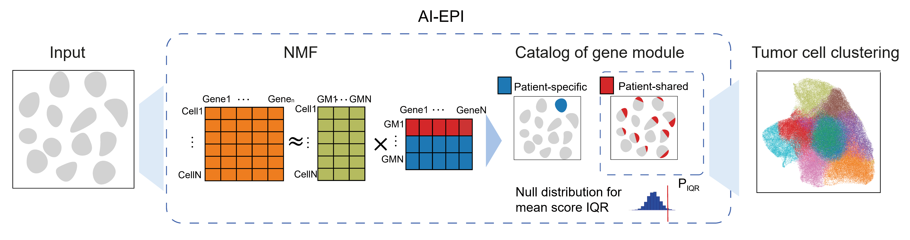
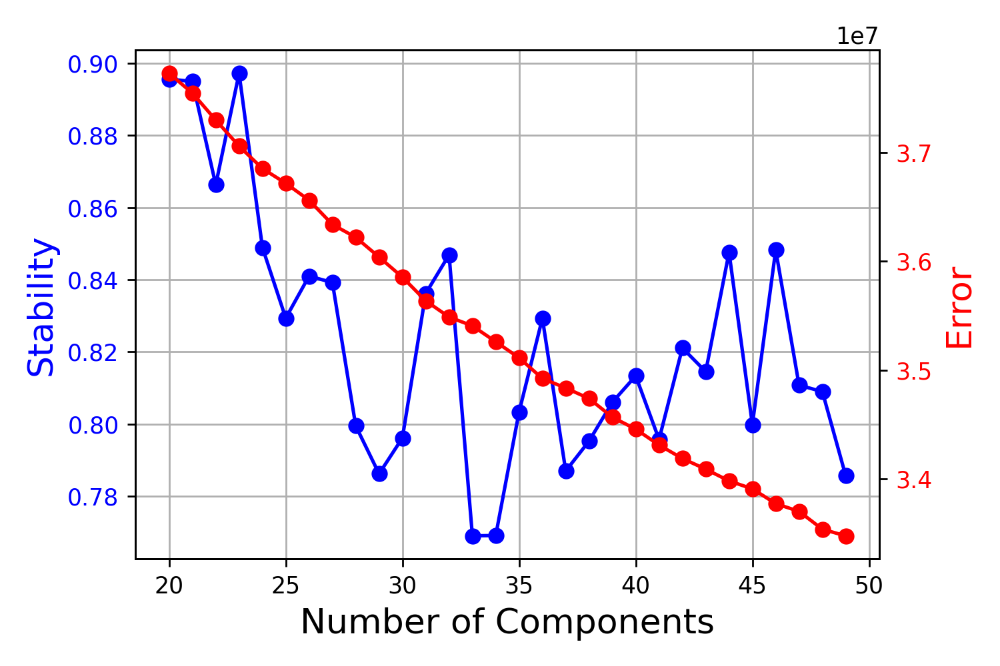
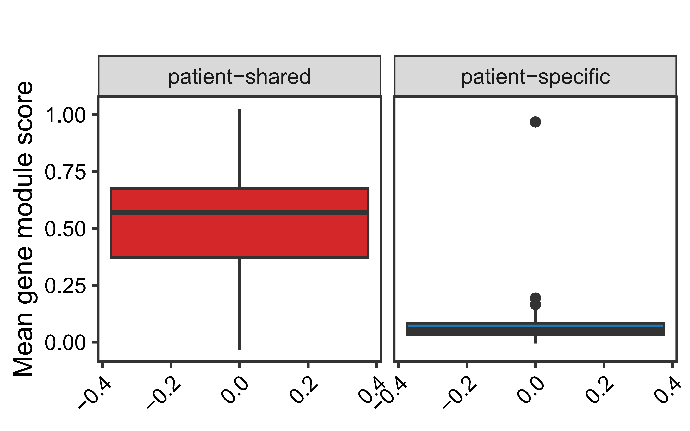

# AIEPI
Atlas-level Integrated Epithelial Program Identification

Malignant epithelial cells are the most heterogeneous cell type with almost every patient forming a separate cluster. Here, we present a method, AI-EPI (Atlas-level Integrated Epithelial Program Identification), which identify patient-shared and patient-specific gene modules (GM) simultaneously and efficiently.The
method mainly contains two steps:

-   gene module identification
-   gene module classification



Installation
------------

the package can be installed directly from the github.

```
git clone Juliebaker1/AIEPI
cd AIEPI
pip install requirement.txt
```

Quick start
-----------

Here, we provide an example data of [GBC_epithelial](http://lifeome.net/software/hrg/GBC_epithelial.h5ad) 
from 10X Genomics. Users can download it and run following scripts to understand the workflow of AIEPI.

Step1:gene program identification
------------------

For malignant epithelial cell number vary among patients, we sample the same cell number from every patient so that they are equally weighted.

```
epithelial_downsample_adata = sampling(epithelial_adata)

```

AI-EPI identifies gene modules by consensus non-negative matrix factorization (cNMF). You can select a appropriate pragram number by the curve of stability and error at each choice of K.
```
gene_program = GM_identification(epithelial_downsample_adata) (# output the default error and stability curve)
cnmf_obj.k_selection_plot(close_fig=False)
```




Step2:gene program classification
-------------

In the second step, we distinguish the patient-shared GM from the patient-specific GM by a permutation test p-value.  

```
GM_classification_result = GM_classification(epithelial_downsample_adata)
```



Downstream analysis
-------------------------------------------------

-   obj:an Seurat object
-   dims:the dimentions of PCA used to construct SNN.(10 by default)
-   nfeatures:the number of features for downstream analysis.(2000 by
    default)
-   overlap\_stop:when the overlap come to this number, iterate will
    stop.(0.75 by default)
-   snn:the neighborhood relationship that is calculated in advance.
-   max\_iteration:the max iteration times
-   neigh\_num:number of neighbors
-   is.save:whether to save intermediate results
-   dir:the save directory

example:

        # find regional distributed genes
        pbmc=FindRegionalGenes(pbmc,dims = 1:10,nfeatures = 2000,overlap_stop = 0.95)
        # the featureplot of the 2 most highly regional genes
        FeaturePlot(pbmc,head(RegionalGenes(pbmc), 2))


