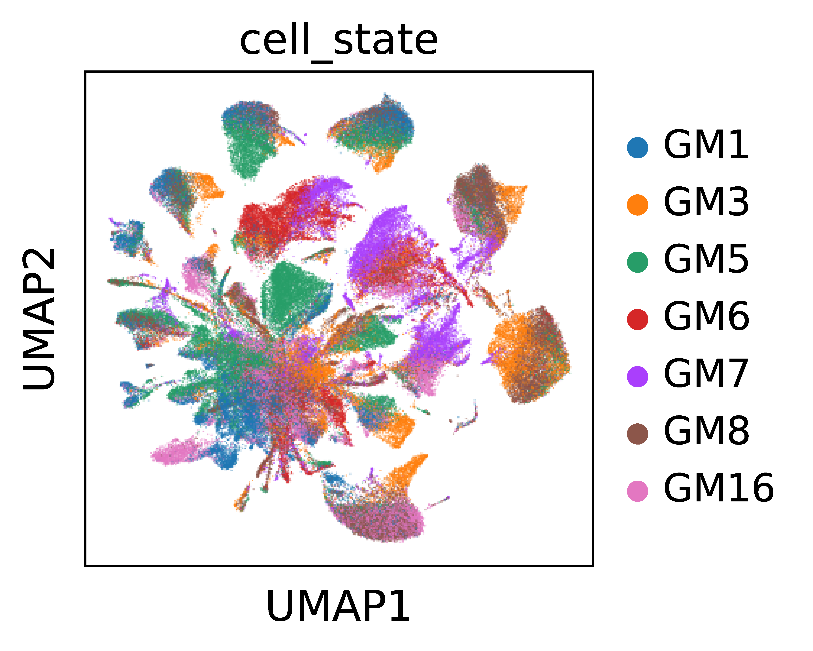

# AI-EPI
Malignant epithelial cells are the most heterogeneous cell type with almost every patient forming a separate cluster. Here, we present a method, AI-EPI (**A**tlas-level **I**ntegrated **E**pithelial **P**rogram **I**dentification), which identify patient-shared and patient-specific gene modules (GM) simultaneously and efficiently.The
method mainly contains two steps:

-   gene module identification
-   gene module classification

<div align=center> 

</div> 

Installation
------------

the package can be installed directly from the github.

```
git clone Juliebaker1/AIEPI
cd AIEPI
pip install requirement.txt
```

Quick start
-----------

Here, we provide an example data of [GBC_epithelial](https://cloud.tsinghua.edu.cn/f/f13f462c11804d2f9302/?dl=1 ) 
from 10X Genomics. Users can download it and run following scripts to understand the workflow of AIEPI.

## Step1: gene module identification

For malignant epithelial cell number vary among patients, we sample the same cell number from every patient so that they are equally weighted.

```
import AI_EPI
sample_number = 500
weighted_sample = downsampling(epithelial_adata.obs,sample_number)
epithelial_downsample_adata = epithelial_adata[weighted_sample.index,]
```
AI-EPI identifies gene modules by consensus non-negative matrix factorization (cNMF). You can select a appropriate pragram number by the curve of stability and error at each choice of K. The down-sampled data of the exampled data can be obtained in [downsampled_data](https://cloud.tsinghua.edu.cn/f/8f90aa56e43c4c5d8a87/?dl=1).The detailed gene module identification code based on down-sampled data can be obtained in [GM_identification.ipynb](https://github.com/JulieBaker1/AIEPI/blob/main/code/1.GM_identification.ipynb).

<div align=center> 

</div> 


## Step2: gene module classification

In the second step, we distinguish the patient-shared GM from the patient-specific GM by a permutation test p-value.  

```
source("code/2.GM_classification.R")
patient_GM_score_23GM_100genes = read.csv("./data/patient_GM_score_23GM_100genes.csv",row.names = 1)
GM_classification_result = GM_classification(patient_GM_score_23GM_100genes)
```
<div align=center> 

</div> 

## Downstream analysis

We can define the state of each cell by the GM with highest GM score. The code can be obtained in [cell_state_assignment.ipynb](https://github.com/JulieBaker1/AIEPI/blob/main/code/3.cell_state_assignment.ipynb).


<div align=center> 

</div> 


